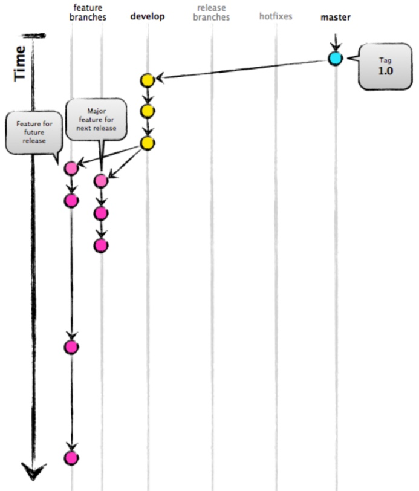
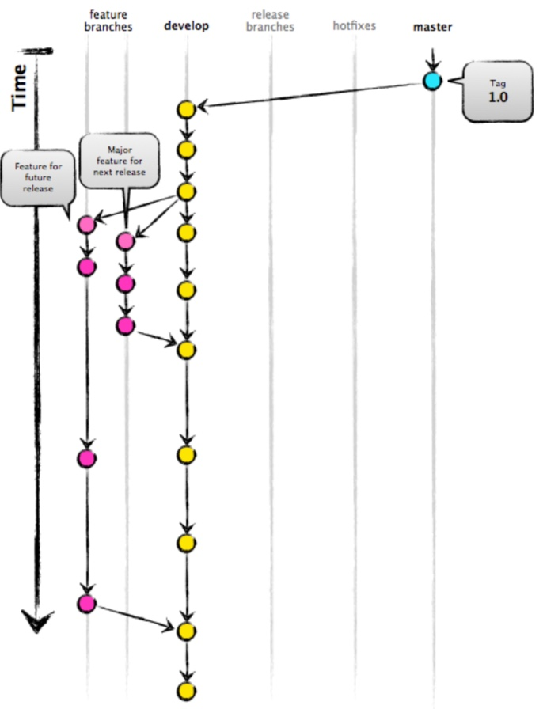
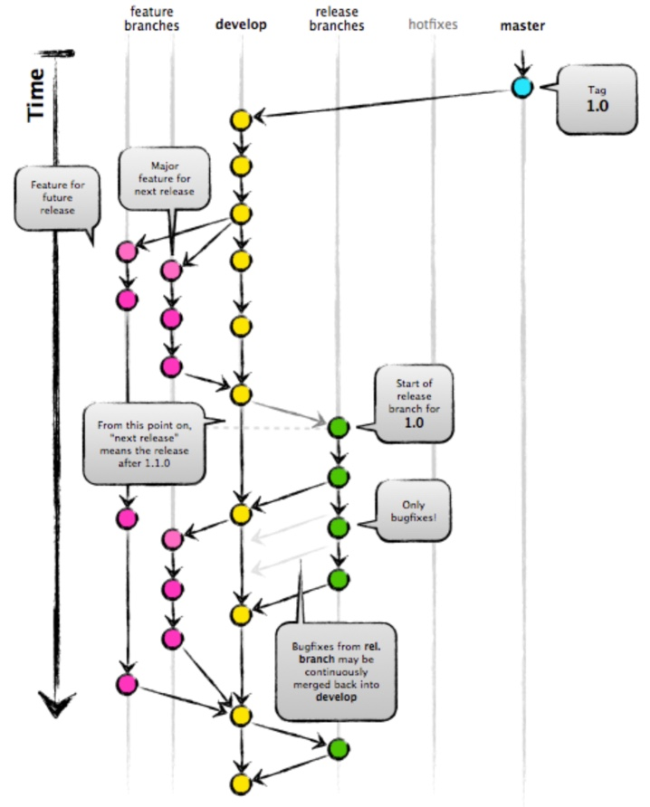
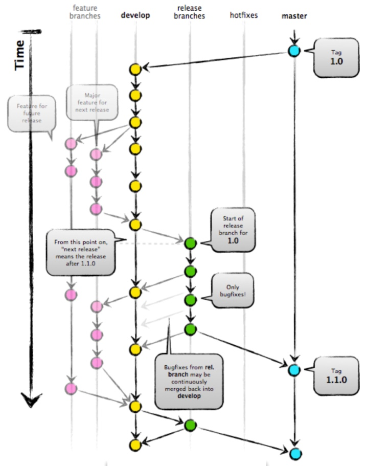
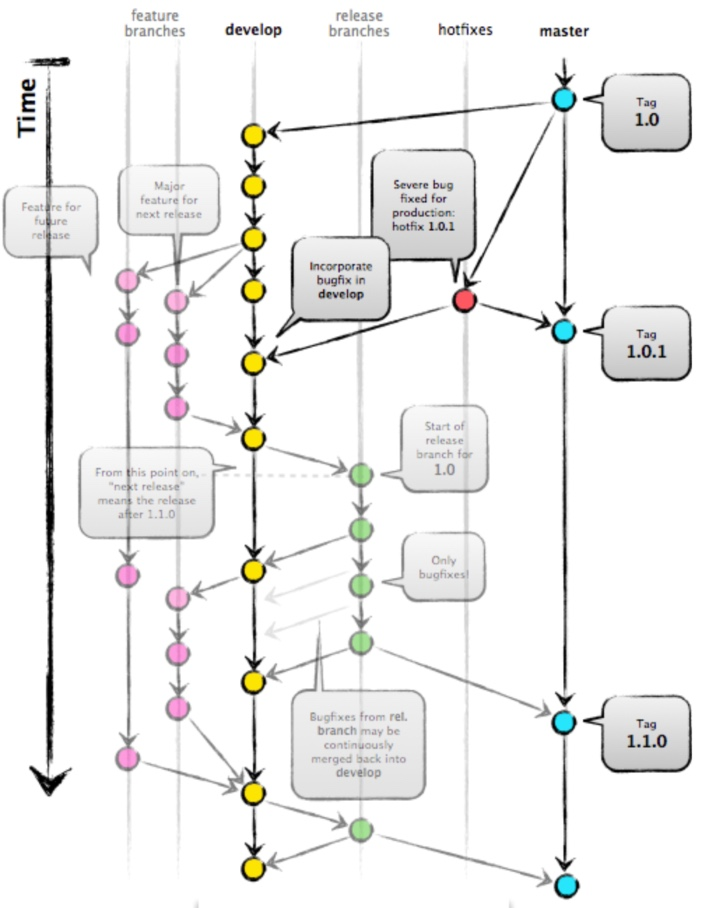

### Git Flow
#### Definition

GitFlow is a stretching model for Git, made by Vincent Driessen. 
It has pulled in a great deal of consideration since it is very appropriate to cooperation and scaling the advancement group.

#### Key Benefits

#####Parallel Development

One of the best things about GitFlow is that it supports parallel development by isolating new development from finished work.

#####Collaboration

It makes easier for two or more developers to integrate on the same feature because each feature branch is a sandbox the only changes are the changes necessary to get the new feature working.

#####Release Staging Area

As new improvement is finished, it gets merged again into the develop branch, which is the staging for all finished highlights that haven't yet been delivered. So when the following release is expand from create, it will naturally contain the entirety of the new stuff that has been done.

#####Support for Emergency Fixes

GitFlow supports hotfix branches which you can use to make an emergency change, where the hotfix will only contain the emergency fixes.

#### How It Works:

New development (new features, non-emergency bug fixes) are built in feature branches:

Feature branches are branched off of the develop branch, and finished features and fixes are merged back into the develop branch when they’re ready for release.

A release branch is created off of develop, when it is time to make a release.

The code in the delivery branch is conveyed onto an appropriate test condition, tried, and any issues are fixed legitimately in the delivery branch. This send - > test - > fix - > redeploy - > retest cycle proceeds until you're upbeat that the delivery is adequate to release to clients.
When the release is finished, the release branch is merged into master and into develop too, to make sure that any changes made in the release branch aren’t accidentally lost by new development.

The master branch tracks released code only. The only commits to master are merges from release branches and hotfix branches.
Hotfix branches are used to create emergency fixes:

They are spread straightforwardly from a tagged release in the master branch, and when completed are converged over into both master and create to ensure that the hotfix isn't incidentally lost when the following customary release happens.

[**Back to Home Page** :houses: ](/README.md)