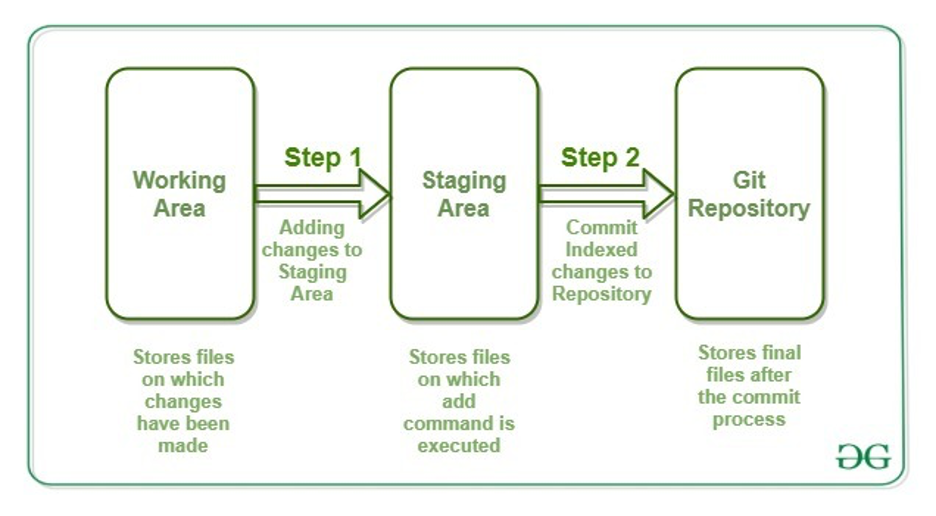
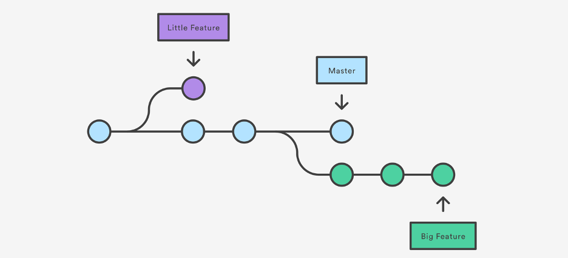
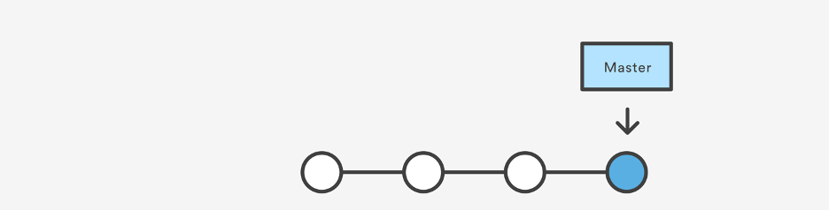
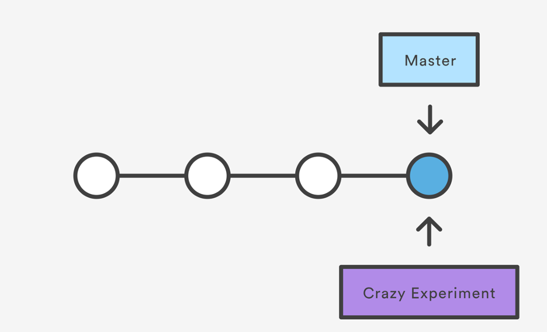
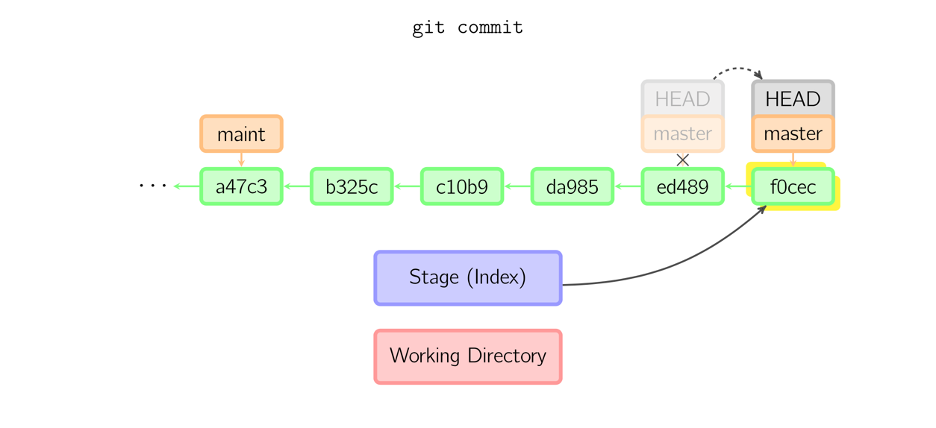
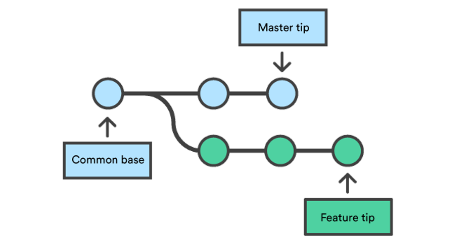
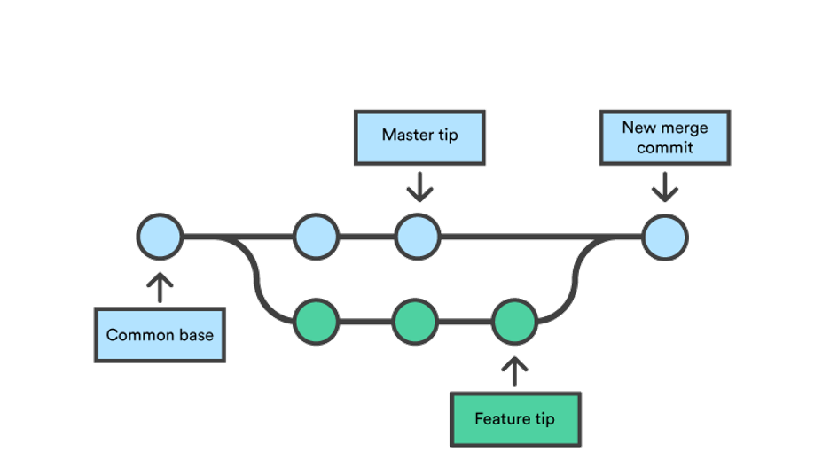

## Git Terminologies
### Repository
A Git repository (or repo for short) contains all of the project files and the entire revision history. You’ll take an ordinary folder of files (such as a website’s root folder), and tell Git to make it a repository. This creates a .git subfolder, which contains all of the Git metadata for tracking changes. On Unix-based operating systems such as macOS, files and folders that start with a period (.) are hidden, so you will not see the .git folder in the macOS Finder unless you show hidden files, but it’s there! You might be able to see it in some code editors.

[Here is a detailed **Step by Step Procedure** to create a repository.](https://www.geeksforgeeks.org/creating-repository-in-github/)

A working tree in a Git Repository is the collection of files which are originated form a certain version of the repository.
There are a few stages of a file in the working tree of a repository:
* **Untracked :** In this stage, the Git repository is unable to track the file, which means that the file is never staged nor it is committed.
* **Tracked:** When the Git repository tracks a file, which means the file is committed but is not staged in the working directory.
* **Staged:** In this stage, the file is ready to be committed and is placed in the staging area waiting for the next commit.
* **Modified/Dirty:** When the changes are made to the file i.e. the file is modified but the change is not yet staged.

GIT needs to follow two more steps to save these changes in the local repository.
These steps are:

i) **Adding the changes to the Index(Staging Area)**

        Syntax:
        $ git add File-name
        Different ways to use add command: 
        To add a specific list of files to staging area.
        $ git add
        To add all files of current directory to staging area.
        $ git add --all
        To add all text files of the current directory to staging area.
        $ git add *.txt
        
        
ii) **Committing the indexed changes into the repository**

Committing process are done in the staging area on the files which are added to the Index after git add command is executed. This committing process is done by the use of git commit command. This command commits the staged changes to the local repository.
        
        Syntax:
        $ git commit -m "Add existing file"

### Clone

This command is used to clone a repository into a new directory. Clones a repository into a newly created directory, creates remote-tracking branches for each branch in the cloned repository (visible using git branch --remotes), and creates and checks out an initial branch that is forked from the cloned repository’s currently active branch.

After the clone, a plain git fetch without arguments will update all the remote-tracking branches, and a git pull without arguments will in addition merge the remote master branch into the current master branch. git clone is used to create a copy of remote repositories. We pass git clone a repository URL.

    Syntax:
    git clone (repository URL) 

### Fork
A fork is a copy of a repository. Forking a repository allows you to freely experiment with changes without affecting the original project. Most commonly, forks are used to either propose changes to someone else's project or to use someone else's project as a starting point for your own idea.
For example, you can use forks to propose changes related to fixing a bug. Rather than logging an issue for a bug you've found, you can do the following:

i)   Fork the repository.

ii)  Make the fix.

iii) Submit a pull request to the project owner.

[Click here to find **Step by Step procedure** to fork a repository.](https://docs.github.com/en/github/getting-started-with-github/fork-a-repo)

### Branch
Branching is a feature available in most modern version control systems. Git branches are effectively a pointer to a snapshot of your changes. The "branch" command helps you create, delete, and list branches.

The diagram above visualizes a repository with two isolated lines of development, one for a little feature, and one for a longer-running feature. By developing them in branches, it’s not only possible to work on both of them in parallel, but it also keeps the main master branch free from questionable code.
#### To create a branch

    git branch crazy-experiment

Creating remote branches

    git remote add new-remote-repo https://bitbucket.com/user/repo.git # Add remote repo to local repo config 
    $ git push crazy-experiment~ # pushes the crazy-experiment branch to new-remote-repo

Deleting Branches

    git branch -d crazy-experiment

### Commit
The git commit command captures a snapshot of the project's currently staged changes. 
Commits are the core building block units of a Git project timeline. Commits can be thought of as snapshots or milestones along the timeline of a Git project. Commits are created with the git commit command to capture the state of a project at that point in time. Git Snapshots are always committed to the local repository. Committed snapshots can be thought of as “safe” versions of a project—Git will never change them unless you explicitly ask it to.

    git commit
    
    git commit -m "commit message"
   
 
 
 In the image above, the current branch is master. Before the command was run, master pointed to ed489. Afterward, a new commit, f0cec, was created, with parent ed489, and then master was moved to the new commit.
 
### Merge

The git merge command lets you take the independent lines of development created by git branch and integrate them into a single branch. Git merge will combine multiple sequences of commits into one unified history. In the most frequent use cases, git merge is used to combine two branches. The following examples in this document will focus on this branch merging pattern. In these scenarios, git merge takes two commit pointers, usually the branch tips, and will find a common base commit between them. Once Git finds a common base commit it will create a new "merge commit" that combines the changes of each queued merge commit sequence.
Say we have a new branch feature that is based off the master branch. We now want to merge this feature branch into master.

Invoking this command will merge the specified branch feature into the current branch, we'll assume master.

**Note:**
All of the commands presented above merge into the current branch. The current branch will be updated to reflect the merge, but the target branch will be completely unaffected. Again, this means that git merge is often used in conjunction with git checkout for selecting the current branch and git branch -d for deleting the obsolete target branch.

 

