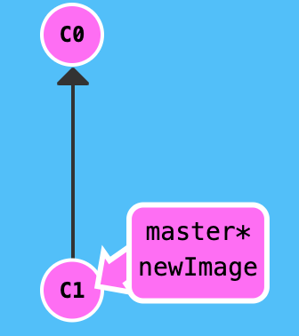
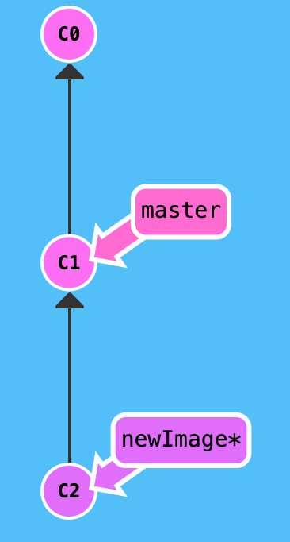
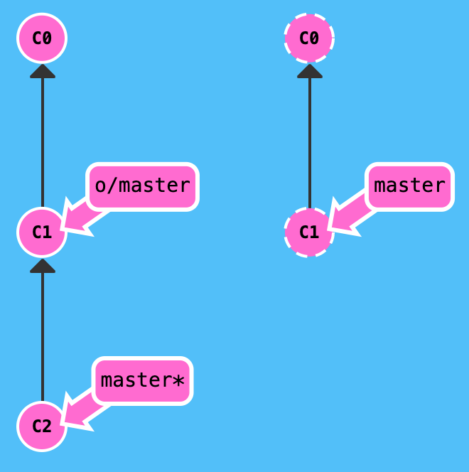
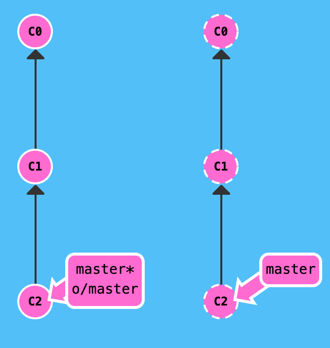
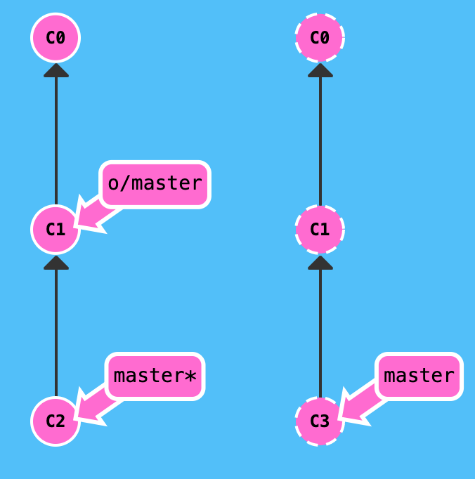
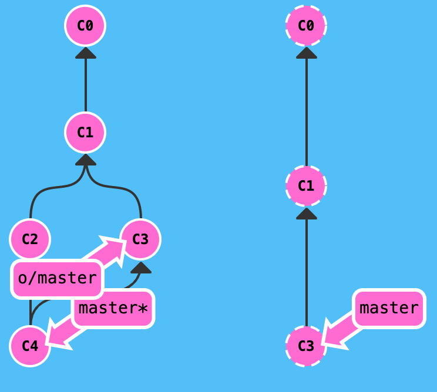

### Remote
 The "remote" command helps you to manage connections to remote repositories.
 It allows you to show which remotes are currently connected, but also to add new connections or remove existing ones.
 
 ##### -v
 Shows URLs of remote repositories when listing your current remote connections. 
 By default, listing remote repositories only shows you their shortnames (e.g. "origin"). 
 Using the "-v" option, you will also see the remote's URLs in listings.
 
    Example: git remote -v
 
 ##### add <shortname> <url>
 
 Creates a new connection to a remote repository.
 The "shortname" you provide can later be used instead of the URL when referencing the remote. 
 A typical default shortname is "origin": this is used for the remote which your local repository was cloned from.
 
    Example: git remote add test test@github.com/test/example.git
 
 ##### remove <name>
 Disconnects the remote from the local repository. 
 Note that this will have no effect on the actual remote repository (i.e. the repository itself is not removed / deleted / etc.).
 
    Example: git remove test 

### Status
Use the git status command, to check the current state of the repository.
Example:

    git status

Result:

    $ git status
    On branch master
    nothing to commit (working directory clean)
    
The command checks the status and reports that there’s nothing to commit, meaning the repository stores the current state of the working directory, and there are no changes to record.
We use the git status command to keep monitoring the states of both the working directory and the repository.

### Checkout
In Git version control, the git checkout command is used to check out of an existing branch and view another branch of code.  
Checkout is essential for working on a new branch, existing branch, or remote branch. 
Checkout in git operates on files, commits, and branches.
Example:

To checkout with new branch:

    git checkout -b branch_name
    
To checkout existing branch, remote branch:

    git checkout branch_name
    
 

### Push
The git push command is used to transfer or push the commit, which is made on a local branch in your computer to a remote repository like GitHub. 
The command used for pushing to GitHub is given below.

        git push 'remote_name' 'branch_name'
        
In the diagram given below, the remote received commit C2, the branch master on the remote was updated to point at C2, and our own reflection of the remote (o/master) was updated as well. 
Everything is in sync now.

 

### PULL 
If you make a change in a repository, GIT PULL can allow others to view the changes. 
It is used to acknowledge the change that you've made to the repository that you're working on. Or also called a target repository.
The simple command to PULL from a branch is:

    git pull 'remote_name' 'branch_name'
    
The git pull command is a combination of git fetch which fetches the recent commits in the local repository and git merge, which will merge the branch from a remote to a local branch also 'remote_name' is the repository name and 'branch_name' is the name of the specific branch.

 

