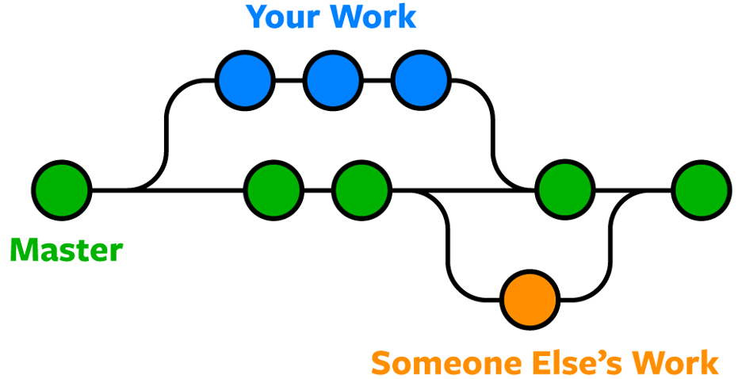
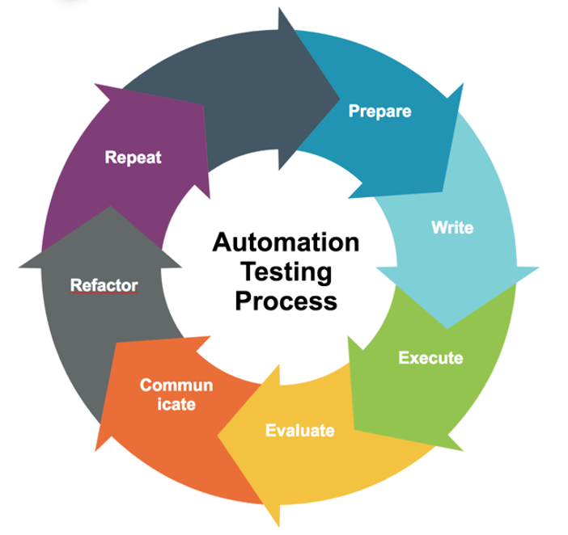
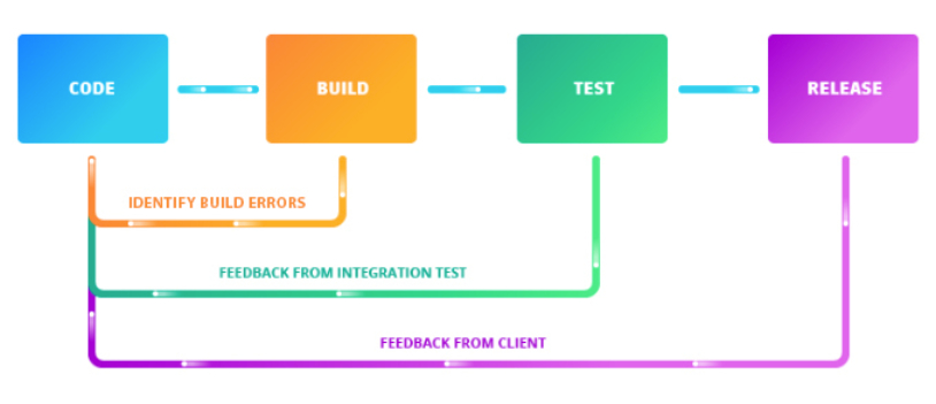

##Git
 Git is the most commonly used version control system. Git tracks the changes you make to files, so you have a record of what has been done, and you can revert to specific versions should you ever need to. Git also makes collaboration easier, allowing changes by multiple people to all be merged into one source. 
 So regardless of whether you write code that only you will see, or work as part of a team, Git will be useful for you. You can access Git via a command line (terminal), or a desktop app that has a GUI (graphical user interface) like SourceTree.

##Docker
Docker is a tool that enables you to create, deploy, and manage lightweight, stand-alone packages that contain everything needed to run an application (code, libraries, runtime, system settings, and dependencies). These packages are called containers. Each container is deployed with its own CPU, memory, block I/O, and network resources, all without having to depend upon an individual kernel and operating system. 
It is because Docker containers encapsulate everything an application needs to run (and only those things), they allow applications to be shuttled easily between environments. Any host with the Docker runtime installed—be it a developer's laptop or a public cloud instance—can run a Docker container.
[For detailed information, Click here](https://www.linode.com/docs/applications/containers/when-and-why-to-use-docker/).

##Automated Testing
An automated testing is to playback pre-recorded and predefined actions, compare the results to the expected behavior and report the success or failure of these manual tests to a test engineer. Once automated tests are created, they can easily be repeated, and they can be extended to perform tasks impossible with manual testing. Because of this, savvy managers have found that automated software testing is an essential component of successful development projects.

##Continuous Integration
Continuous Integration (CI) is a development practice where developers integrate code into a shared repository frequently, preferably several times a day. Each integration can then be verified by an automated build and automated tests. Google for instance, develops and releases new features almost daily - using an agile and continuous development process to streamline the launch and deployment of each of their products. By following the same steps over years, Google has been able to minimize the time it takes to build, test and release new features; while ensuring that their quality standard is maintained.

The benefits of using Git, Docker, automated testing and continuous integration in a software project are:

* Faster Delivery of New Features
* Better Quality Product
* Risk Avoidance
* Less Resource Requirement
* Increased Productivity

